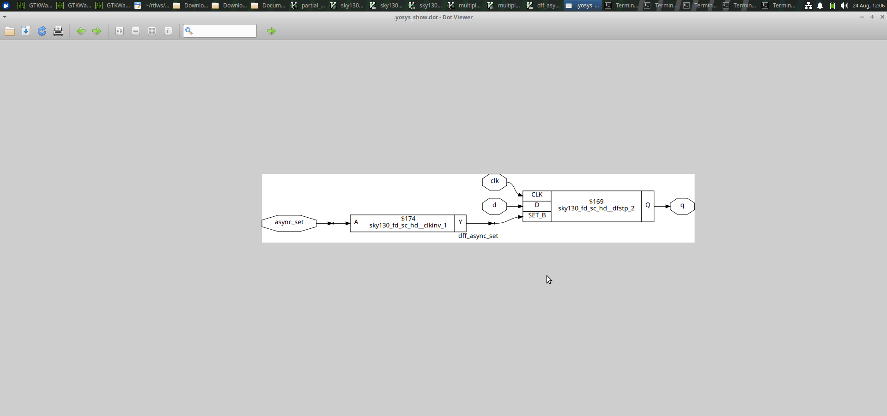
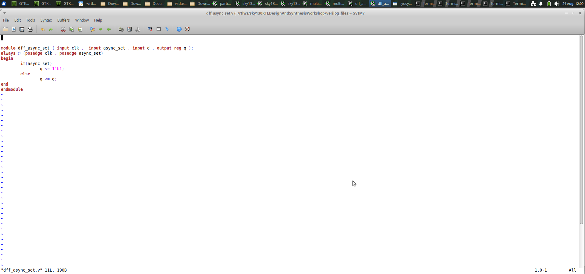
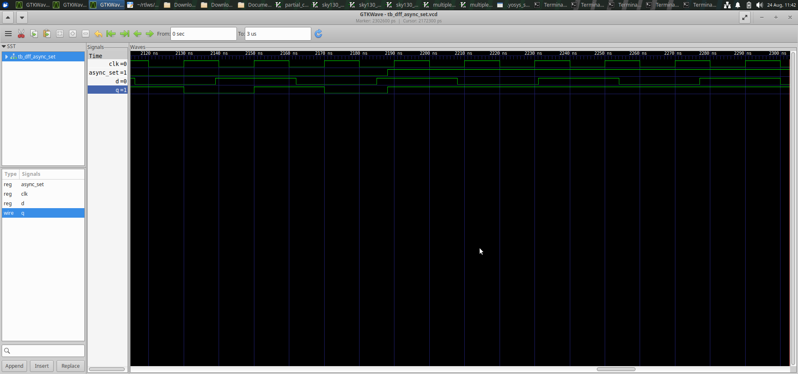
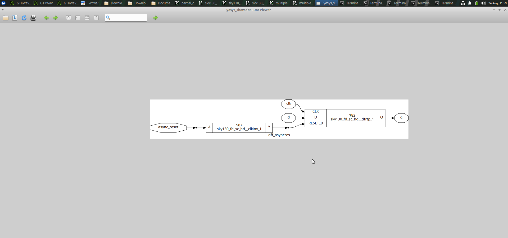
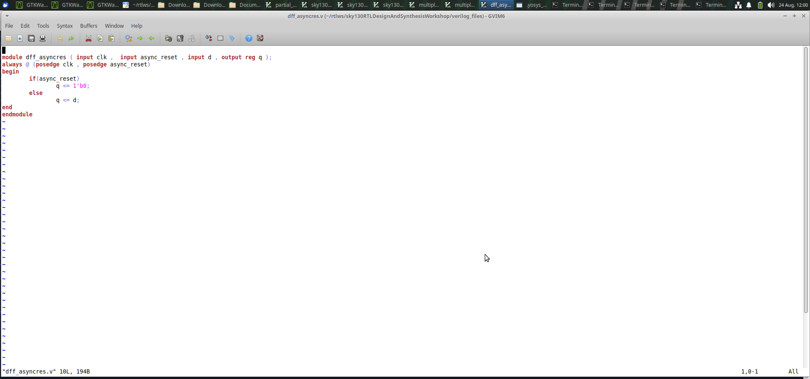
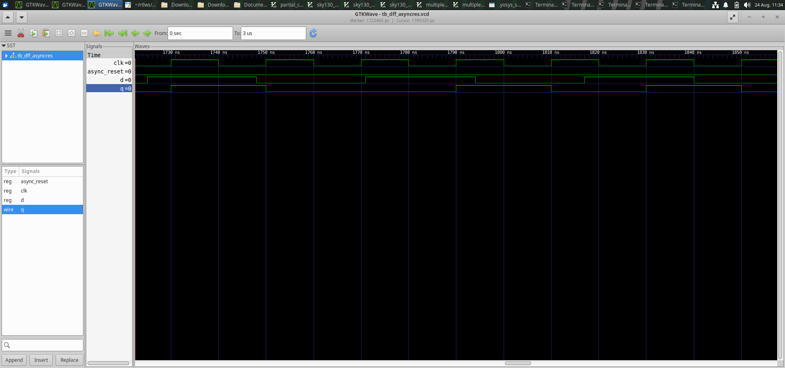
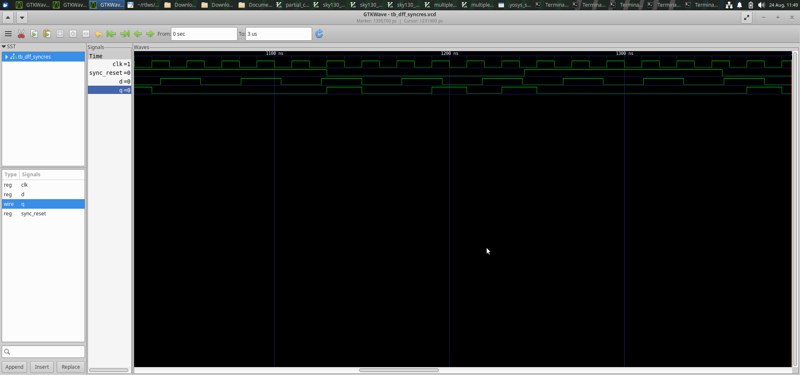

# Day 2 - Sequential Logic, DFFs, Multiple Modules and Hierarchical Design

## Overview

Day 2 of the RTL Design Workshop focuses on sequential logic design,
different types of D Flip-Flops (DFFs), asynchronous and synchronous
control signals, multiple RTL modules, hierarchical design and
multiplier implementations.

The experiments were simulated and synthesized to understand the
relationship between RTL code, simulation waveforms, synthesized
netlists and block diagrams.

---

## Objectives

The main objectives of Day 2 are:

- To understand D Flip-Flop based sequential logic.
- To study asynchronous set/reset operation.
- To study synchronous reset operation.
- To understand the difference between asynchronous and synchronous
  control signals.
- To understand the concept of multiple RTL modules.
- To study hierarchical module design.
- To analyze synthesized netlists and block diagrams.
- To understand multiplier implementations.
- To verify RTL designs using simulation waveforms.
- To observe how RTL code is converted into hardware during synthesis.

---

# 1. D Flip-Flop with Asynchronous Set

A D Flip-Flop stores the value of the data input at the active clock
edge.

An asynchronous set allows the output of the flip-flop to be set
independently of the clock.

This means that the set signal can change the output immediately
without waiting for a clock edge.

### DFF Asynchronous Set Block Diagram

### DFF Asynchronous Set Netlist

### DFF Asynchronous Set Waveform

---

# 2. D Flip-Flop with Asynchronous Set and Reset

This experiment demonstrates a D Flip-Flop with asynchronous control
signals.

The asynchronous set/reset signals operate independently of the clock.
Therefore, the output can change immediately when the asynchronous
control signal is activated.

### DFF Async/Reset Block Diagram

### DFF Async/Reset Netlist

### DFF Async/Reset Waveform

---

# 3. D Flip-Flop with Synchronous Reset

A synchronous reset is different from an asynchronous reset.

In a synchronous reset design, the reset operation takes effect only
at the active clock edge.

Therefore, the output does not change immediately when the reset
signal changes. The clock controls when the reset operation occurs.

### DFF Synchronous Reset Netlist and Block Diagram

### DFF Synchronous Reset Waveform

---

# 4. Asynchronous vs Synchronous Reset

The main difference between asynchronous and synchronous reset is the
dependence on the clock.

| Feature | Asynchronous Reset | Synchronous Reset |
|--------|--------------------|-------------------|
| Clock required for reset | No | Yes |
| Reset response | Immediate | At clock edge |
| Clock dependency | Independent | Dependent |
| Typical use | Fast initialization/control | Controlled sequential operation |

Understanding this difference is important when designing reliable
sequential circuits.

---

# 5. Multiple RTL Modules

A large digital design can be divided into multiple smaller modules.

Each module performs a specific function and can be connected to other
modules to form a complete system.

Using multiple modules improves:

- Design organization
- Reusability
- Debugging
- Readability
- Verification
- Hierarchical design

---

## 5.1 Multiple Module Netlist

The multiple-module experiment demonstrates how separate RTL modules
are connected and synthesized as a complete design.

### Multiple Module Netlist and Block Diagram

---

# 6. Hierarchical Module Design

Hierarchical design means building a larger design by connecting
smaller sub-modules.

A top-level module can instantiate lower-level modules. This allows
complex designs to be divided into manageable blocks.

The synthesis tool combines the modules and generates the corresponding
hardware netlist.

### Hierarchical Netlist 1

### Hierarchical Netlist 2

---

# 7. 2-bit Multiplier

A multiplier is a combinational circuit that performs binary
multiplication.

The 2-bit multiplier experiment demonstrates a simple multiplier
implementation and its synthesized hardware structure.

### 2-bit Multiplier Netlist and Block Diagram

---

# 8. 8-bit Multiplier

The 8-bit multiplier demonstrates a larger multiplier implementation.

As the input width increases, the amount of hardware required for the
multiplication operation also increases.

### 8-bit Multiplier Netlist and Block Diagram

---

# 9. RTL Simulation and Waveform Analysis

Simulation is used to verify whether the RTL design behaves according
to the intended functionality.

Waveforms help us observe:

- Clock signals
- Data signals
- Reset/set signals
- Output signals
- Changes in output with respect to inputs
- Synchronous and asynchronous behavior

Waveform analysis is an important part of RTL verification before
synthesis.

---

# 10. Netlist and Block Diagram Analysis

After synthesis, the RTL description is converted into a gate-level
netlist.

The netlist represents the hardware elements and their connections.

The block diagram provides a graphical representation of the
synthesized design.

By comparing the RTL code, simulation waveform and synthesized
netlist, we can understand how Verilog code is converted into actual
hardware.

---

# 11. Sequential Logic

Sequential circuits depend on both the current inputs and the previous
state of the circuit.

D Flip-Flops are basic sequential elements used for storing one bit of
information.

The Day 2 experiments demonstrate how DFFs can be controlled using
clock, asynchronous and synchronous signals.

---

# 12. Important Concepts Learned

### D Flip-Flop

A D Flip-Flop stores one bit of data and updates its output based on
the clock.

### Asynchronous Control

An asynchronous control signal can affect the flip-flop output without
waiting for a clock edge.

### Synchronous Control

A synchronous control signal affects the output only at the active
clock edge.

### Hierarchical Design

A complex RTL design can be divided into smaller modules and connected
together using module instantiation.

### Synthesis

Synthesis converts RTL code into a hardware representation consisting
of logic cells and their connections.

---

# 13. Files Included

The Day 2 folder contains the following files:

- `README.md`
- `dff_async_set_blockdiagram.png`
- `dff_async_set_netlist.png`
- `dff_async_set_waveform.png`
- `dff_asyncres_blockdiagram.png`
- `dff_asyncres_netlist.png`
- `dff_asyncres_waveformm.png`
- `dff_syncres_netlist and blockdiagram.png`
- `dff_syncres_waveform.png`
- `mult_2_netlist and blockdiagram.png`
- `mult_8_netlist and blockdiagram.png`
- `multiple_module_flat_netlist1.png`
- `multiple_module_flat_netlist2.png`
- `multiple_modules_hier netlist 1.png`
- `multiple_modules_hier netlist 2.png`
- `multiple_modules_netlist and blockdiagram.png`

---

# 14. Key Learning

From the Day 2 experiments, I learned:

1. The working principle of a D Flip-Flop.
2. The difference between asynchronous and synchronous control.
3. The operation of asynchronous set/reset.
4. The operation of synchronous reset.
5. How sequential logic is represented using RTL.
6. How multiple RTL modules can be combined.
7. The concept of hierarchical module design.
8. How modules are flattened during synthesis.
9. How multipliers are implemented using RTL.
10. How input width affects multiplier hardware.
11. How to analyze RTL simulation waveforms.
12. How to analyze synthesized netlists and block diagrams.
13. How RTL code is converted into hardware through synthesis.

---

# 15. Conclusion

Day 2 provided practical knowledge of sequential RTL design and
synthesis.

The D Flip-Flop experiments helped in understanding asynchronous and
synchronous control signals. The multiple-module and hierarchical
design experiments demonstrated how complex RTL designs can be
organized using smaller reusable modules.

The multiplier experiments provided an understanding of combinational
arithmetic hardware and how the size of the inputs affects the
synthesized hardware.

Overall, the experiments helped in understanding the complete flow from
RTL coding and simulation to synthesis, netlist generation and hardware
implementation.
