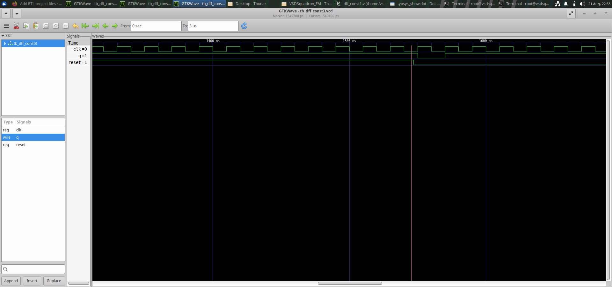

# Day 3 - Combinational And Sequential Optimizations

Day 3 focuses on understanding combinational and sequential logic, constant
propagation, counter design, and RTL optimization using
simulation and synthesis tools.

In this session, I worked with D flip-flops having constant
inputs, a counter design, and different logic optimization
examples.

The designs were simulated to verify their behavior and
synthesized using Yosys to understand how RTL descriptions
are converted into optimized hardware.

---

# Index

1. [Objective](#1-objective)
2. [DFF Constant 1](#2-dff-constant-1)
3. [DFF Constant 2](#3-dff-constant-2)
4. [DFF Constant 3](#4-dff-constant-3)
5. [Counter Design](#5-counter-design)
6. [Optimization Check 1](#6-optimization-check-1)
7. [Optimization Check 2](#7-optimization-check-2)
8. [Optimization Check 3](#8-optimization-check-3)
9. [Optimization Check 4](#9-optimization-check-4)
10. [Overall Learning](#10-overall-learning)
11. [Conclusion](#11-conclusion)

---

# 1. Objective

The main objective of Day 3 was to understand how sequential
RTL designs and simple logic expressions are handled during
simulation and synthesis.

The main concepts covered were:

- D flip-flops
- Clock signals
- Reset signals
- Constant inputs
- Sequential logic
- Counter design
- Constant propagation
- Logic optimization
- RTL simulation
- GTKWave waveform analysis
- Yosys synthesis
- Synthesized netlist and block diagrams

---

# 2. DFF Constant 1

## What I designed

In this experiment, I worked with a D flip-flop whose input
is connected to a constant value.

A D flip-flop normally stores the value present at its D input
on the active clock edge.

When the D input is fixed to a constant, the output behavior
becomes predictable after the flip-flop is triggered.

The experiment was used to understand how synthesis tools
handle constant values connected to sequential elements.

## Simulation

The design was simulated and the output waveform was
observed using GTKWave.

The clock, reset, and output behavior were checked during
simulation.

## Synthesis

The RTL was synthesized using Yosys.

The synthesized representation was examined to understand
how the constant input affects the final hardware.

## Result

This experiment showed how a constant input can simplify the
logic associated with a sequential circuit.

---

# 3. DFF Constant 2

## What I designed

In this experiment, another D flip-flop with constant logic
was studied.

The purpose was to observe how Yosys identifies fixed values
and simplifies the corresponding RTL during synthesis.

## Simulation

The design was simulated to verify the behavior of the
flip-flop.

The waveform was observed using GTKWave.

## Synthesis

The design was passed through Yosys synthesis to generate
the corresponding hardware representation.

## Result

The experiment helped me understand how constant values can
reduce unnecessary logic during synthesis.

---

# 4. DFF Constant 3

## What I designed

This experiment is another example of a D flip-flop with
constant behavior.

The design was used to observe how sequential logic behaves
when its data input is fixed.

## Simulation

The RTL was simulated and the output waveform was observed
using GTKWave.

## Synthesis

The design was synthesized using Yosys.

The generated netlist and block diagram were examined to
understand the optimized hardware representation.

![DFF Constant 3 Netlist](dff_const3_netlist%20and%
