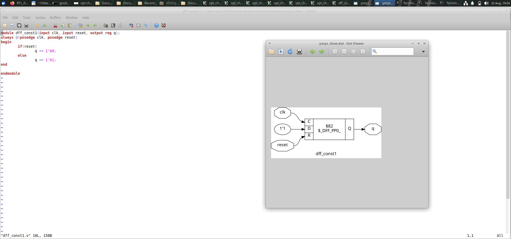
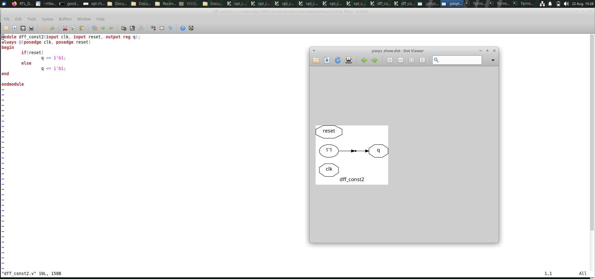
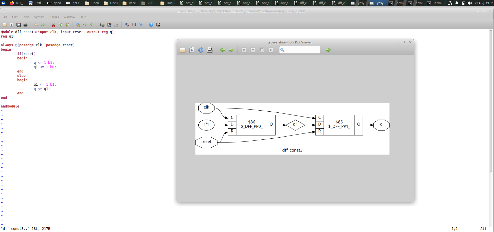
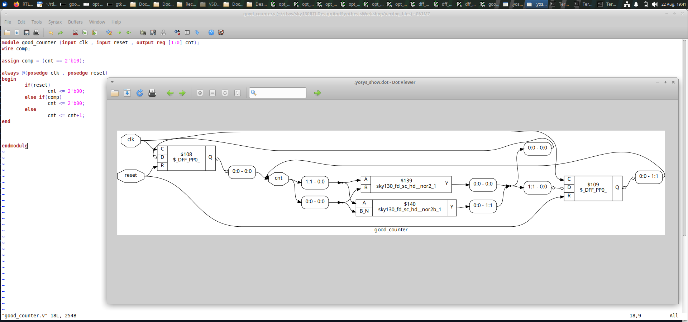
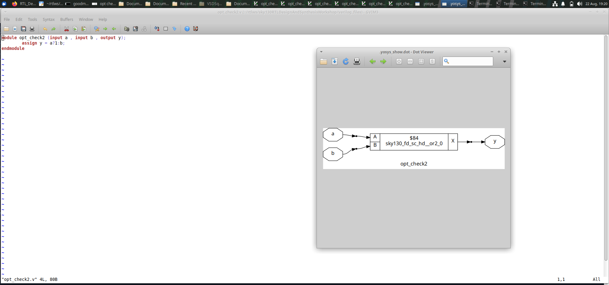

# Day 3 - RTL Optimization and Sequential Logic

Day 3 was focused on exploring sequential circuits and
understanding how synthesis tools optimize RTL descriptions.

The experiments included D flip-flops, counters, constant
logic, and different combinational logic optimization cases.

The designs were simulated to verify their functionality and
were synthesized using Yosys to observe the resulting
hardware implementation.

---

# Index

1. [Objective](#1-objective)
2. [DFF Constant 1](#2-dff-constant-1)
3. [DFF Constant 2](#3-dff-constant-2)
4. [DFF Constant 3](#4-dff-constant-3)
5. [Counter](#5-counter)
6. [Optimization Check 1](#6-optimization-check-1)
7. [Optimization Check 2](#7-optimization-check-2)
8. [Optimization Check 3](#8-optimization-check-3)
9. [Optimization Check 4](#9-optimization-check-4)
10. [Overall Learning](#10-overall-learning)
11. [Conclusion](#11-conclusion)

---

# 1. Objective

The main objective of Day 3 was to understand how RTL
descriptions are converted into hardware during synthesis
and how Yosys optimizes the generated logic.

The important concepts explored were:

- D flip-flop based sequential circuits
- Clock and reset operation
- Constant value propagation
- Sequential logic optimization
- Counter implementation
- Combinational logic optimization
- RTL simulation
- Waveform verification using GTKWave
- Gate-level representation using Yosys

---

# 2. DFF Constant 1

## What I designed

In this experiment, I worked with a D flip-flop whose
behavior is controlled by a constant value.

The design uses a clock and reset along with the flip-flop
output.

The main purpose was to observe how a constant input affects
the behavior of a sequential element.

## Simulation

The design was simulated and the waveform was observed to
verify the output behavior with respect to the clock and
reset signals.

### Simulation Result

## Synthesis

The design was synthesized using Yosys.

Yosys analyzed the RTL and generated a simplified hardware
representation based on the constant logic present in the
design.

### Synthesized Result

## Observation

This experiment shows that constant signals can make a
sequential design simpler during synthesis.

---

# 3. DFF Constant 2

## What I designed

The second experiment was another D flip-flop based design
used to study constant logic during synthesis.

The circuit includes sequential behavior controlled by the
clock and reset signals.

The experiment was useful for understanding how synthesis
tools identify fixed values in an RTL description.

## Simulation

The waveform was observed to check the relationship between
the clock, reset, and output signals.

### Simulation Result

## Synthesis

The RTL design was processed through Yosys synthesis.

The resulting circuit represents the optimized hardware
after synthesis.

### Synthesized Result

## Observation

The synthesized result demonstrates that Yosys can simplify
logic when the input to a sequential element remains fixed.

---

# 4. DFF Constant 3

## What I designed

This experiment contains another D flip-flop with constant
logic.

The objective was to compare the RTL behavior with the
hardware representation generated after synthesis.

## Simulation

The circuit was simulated and the output waveform was
observed using GTKWave.

The clock and reset conditions were checked to verify the
expected sequential behavior.

### Simulation Result

## Synthesis

The design was synthesized using Yosys.

Yosys optimized the RTL and generated the corresponding
gate-level representation.

### Synthesized Result

## Observation

This experiment shows how constant logic can be simplified
by the synthesis tool while maintaining the required
functionality.

---

# 5. Counter

## What I designed

In this experiment, I worked with a counter implemented
using sequential logic.

A counter changes its state based on clock transitions.
A reset signal can be used to bring the counter back to
its initial state.

The main signals involved in the design are:

- Clock
- Reset
- Counter output

## Simulation

The counter was simulated to verify that its output changes
according to the applied clock signal.

The waveform was used to observe the sequential behavior
of the counter.

### Counter Simulation Result

## Synthesis

The counter was also synthesized to understand how the RTL
counter is represented as hardware.

### Counter Block Diagram

## Observation

The counter experiment helped in understanding how multiple
sequential elements can work together to form a larger
digital circuit.

---

# 6. Optimization Check 1

## What I designed

This experiment was performed to study the optimization of
a simple combinational logic expression.

The RTL contains basic logic operations that can be analyzed
and simplified during synthesis.

## Synthesis

The design was passed through the Yosys synthesis flow.

Yosys examined the Boolean logic and generated an optimized
hardware representation.

### Result

## Observation

The result demonstrates that the synthesized circuit may be
simpler than the original RTL description because unnecessary
logic can be removed during optimization.

---

# 7. Optimization Check 2

## What I designed

This experiment uses another logic expression to examine
how Yosys handles combinational logic during synthesis.

The main purpose was to understand how the synthesis tool
finds a suitable hardware implementation for the given RTL.

## Synthesis

Yosys optimized the logic and generated the corresponding
gate-level representation.

### Result

## Observation

The synthesized circuit shows how a Boolean expression can
be mapped into a smaller and more efficient hardware
structure.

---

# 8. Optimization Check 3

## What I designed

This experiment was used to study another example of
combinational logic optimization.

The RTL description was processed through Yosys to observe
the changes made during synthesis.

## Synthesis

During synthesis, Yosys analyzed the logic and removed
unnecessary operations wherever possible.

### Result

## Observation

The generated hardware representation helps in understanding
how synthesis converts RTL logic into standard gate-level
structures.

---

# 9. Optimization Check 4

## What I designed

The fourth optimization experiment was used to further
observe the behavior of Yosys when processing simple
combinational logic.

The experiment helps in understanding how different RTL
descriptions can be optimized into efficient hardware.

## Synthesis

The design was synthesized using Yosys and the optimized
result was observed.

### Result

## Observation

The result shows that Yosys performs optimization before
producing the final synthesized representation.

This can reduce unnecessary hardware and provide a simpler
implementation of the required logic.

---

# 10. Overall Learning

Through the Day 3 experiments, I learned:

- How D flip-flops operate as sequential elements.
- How clock signals control sequential circuits.
- How reset signals initialize sequential designs.
- How constant values affect D flip-flop circuits.
- How synthesis tools identify constant logic.
- How Yosys simplifies unnecessary logic.
- How counters are constructed using sequential logic.
- How combinational logic can be optimized.
- How GTKWave helps in checking simulation waveforms.
- How Yosys generates gate-level circuit representations.
- How RTL descriptions are transformed into hardware.

---

# 11. Conclusion

Day 3 provided practical experience with sequential logic
and RTL optimization.

The experiments covered D flip-flops with constant logic,
counter design, and several combinational optimization
examples.

By performing simulation and synthesis, I was able to
understand the difference between an RTL description and its
optimized hardware representation.

Overall, these experiments helped me understand how Yosys
analyzes RTL, removes unnecessary logic, and produces an
efficient hardware implementation while maintaining the
required circuit functionality.
