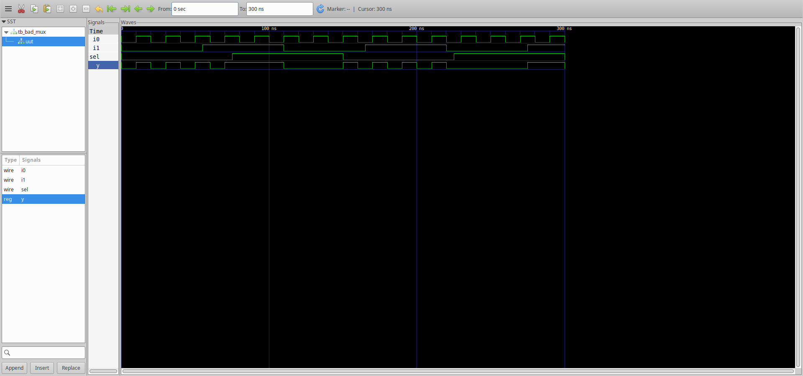
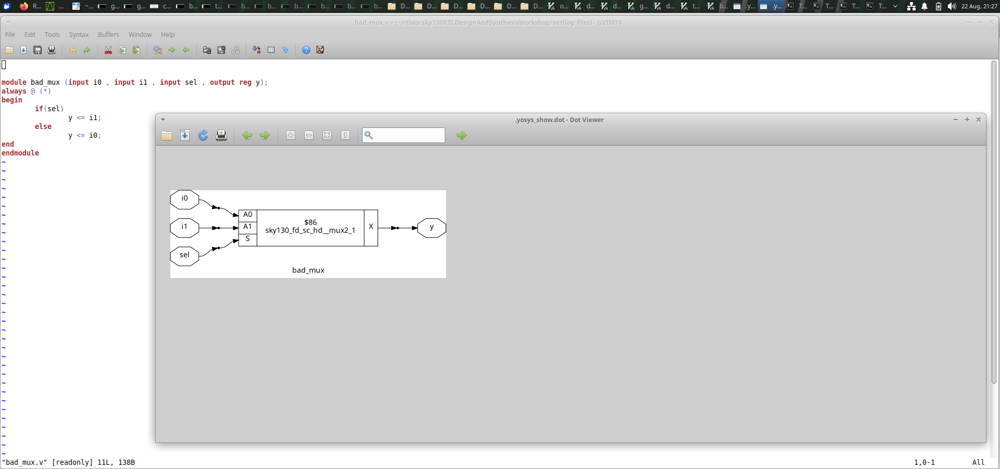
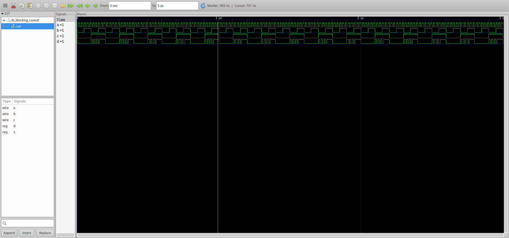
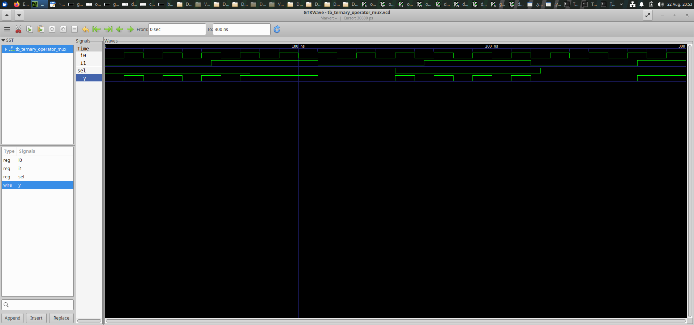
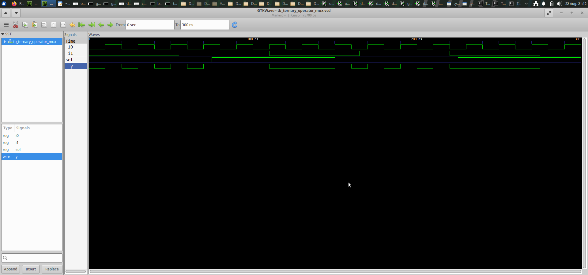

# Day 4 - RTL Coding Styles and Multiplexer Design

Day 4 focuses on understanding RTL coding practices and
the implementation of combinational circuits using Verilog.

In this session, I worked with a 2:1 multiplexer, blocking
assignment behavior, and a MUX implemented using the
ternary operator.

The designs were simulated and analyzed at the RTL level,
and synthesis results were observed using Yosys.

---

# Index

1. [Objective](#1-objective)
2. [Bad MUX](#2-bad-mux)
3. [Blocking Caveat](#3-blocking-caveat)
4. [Ternary Operator MUX](#4-ternary-operator-mux)
5. [Overall Learning](#5-overall-learning)
6. [Conclusion](#6-conclusion)

---

# 1. Objective

The main objective of Day 4 was to understand how RTL
coding styles are used to describe combinational hardware
and how the RTL is converted into synthesized logic.

The main concepts covered were:

- 2:1 Multiplexer
- RTL coding style
- Blocking assignments
- Combinational logic
- Ternary operator
- RTL simulation
- Gate-level synthesis
- Yosys synthesis flow
- GTKWave waveform analysis
- Comparison of RTL and synthesized hardware

---

# 2. Bad MUX

## What I designed

In this experiment, I worked with a simple 2:1 multiplexer
described using Verilog RTL.

A multiplexer selects one of multiple input signals and
passes the selected signal to its output.

The design consists of:

- `i0` - First input
- `i1` - Second input
- `sel` - Select signal
- `y` - Output

The operation of the MUX is:

- When `sel = 0`, `y` follows `i0`.
- When `sel = 1`, `y` follows `i1`.

The purpose of this experiment was to understand how a
MUX description in RTL is represented during simulation
and synthesis.

## RTL Simulation

The MUX was simulated using the Verilog simulation flow.

The input signals, select signal, and output were observed
to verify the functional behavior of the design.

The simulation result helps confirm that the output changes
according to the selected input.

### RTL Result

## Gate-Level / Synthesis Result

The design was processed through the synthesis flow using
Yosys.

The RTL description was converted into a hardware-level
representation, where the MUX functionality can be
implemented using a standard multiplexer cell.

### GLS Result

## Additional Result

The additional result image generated during the experiment
is also included below.

## Result

This experiment helped me understand how a basic MUX is
described in RTL and how the synthesis tool converts the
description into hardware logic.

---

# 3. Blocking Caveat

## What I designed

In this experiment, I studied the behavior of blocking
assignments in Verilog RTL.

Blocking assignments are executed in the order in which
they are written inside a procedural block.

Therefore, the sequence of statements can affect the
intermediate values and the final output during simulation.

This experiment was useful for understanding an important
aspect of RTL coding and combinational logic design.

## Simulation

The design was simulated to observe the behavior of the
signals.

The waveform was analyzed to understand how the input
signals affect the output and how the procedural statements
are evaluated.

### Simulation Result

## RTL Result

The RTL representation of the blocking-caveat design is
included below.

## Synthesis Result

The design was also processed through synthesis.

Yosys analyzed the RTL and generated the corresponding
hardware logic.

The synthesized result helps show how the procedural RTL
description is converted into combinational hardware.

### Gate-Level Result

## Result

This experiment helped me understand that blocking
assignments are executed sequentially and that the order
of assignments can be important when describing RTL logic.

It also demonstrated how the synthesis tool interprets the
RTL and creates the required hardware implementation.

---

# 4. Ternary Operator MUX

## What I designed

In this experiment, I implemented a 2:1 multiplexer using
the Verilog ternary operator.

The ternary operator provides a compact method of describing
conditional selection logic.

The basic MUX expression is:

`y = sel ? i1 : i0;`

This means:

- If `sel = 0`, `i0` is selected.
- If `sel = 1`, `i1` is selected.

The design contains:

- `i0` - First input
- `i1` - Second input
- `sel` - Select signal
- `y` - Output

## RTL Simulation

The ternary-operator MUX was simulated to verify its
functional behavior.

The input signals and select signal were varied, and the
output was observed to confirm that the correct input is
selected.

### RTL Result

## Synthesis

The RTL was synthesized using Yosys.

Yosys recognizes the ternary conditional expression as
multiplexer logic and converts it into an appropriate
hardware implementation.

### GLS Result

## Additional Result

An additional result from the ternary operator experiment
is also included.

## Result

This experiment showed that the ternary operator can be
used as a simple and compact way to describe a multiplexer.

It also demonstrated that the synthesis tool can identify
the intended MUX functionality and map it into hardware.

---

# 5. Overall Learning

Through the Day 4 experiments, I understood the following:

- How a 2:1 MUX works.
- How to describe a MUX using Verilog RTL.
- How the select signal determines the MUX output.
- How blocking assignments work in procedural RTL.
- Why the order of blocking assignments matters.
- How the ternary operator can be used to describe a MUX.
- How RTL designs are simulated before synthesis.
- How GTKWave can be used to examine signal waveforms.
- How Yosys converts RTL into synthesized hardware.
- How RTL and gate-level representations are related.
- How different coding styles can describe the same
  hardware functionality.

---

# 6. Conclusion

Day 4 provided a better understanding of RTL coding styles
and combinational circuit design.

I worked with a 2:1 MUX, blocking assignments, and a
ternary-operator based MUX.

By analyzing the RTL results, simulation waveforms, and
synthesis outputs, I understood how Verilog descriptions
are interpreted by synthesis tools and converted into
hardware.

These experiments also highlighted the importance of using
clear and appropriate RTL coding styles when designing
digital circuits.
