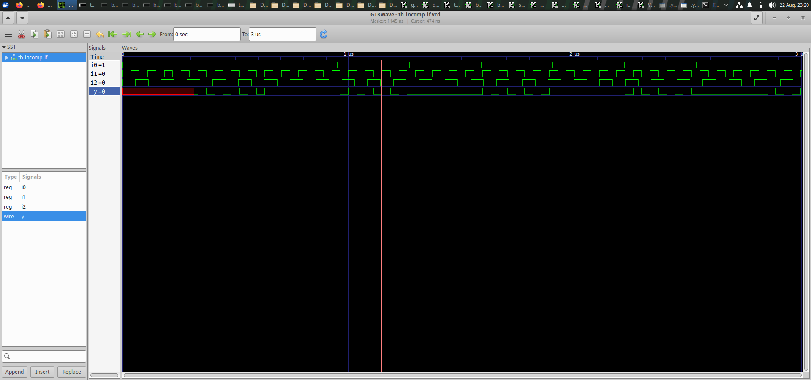
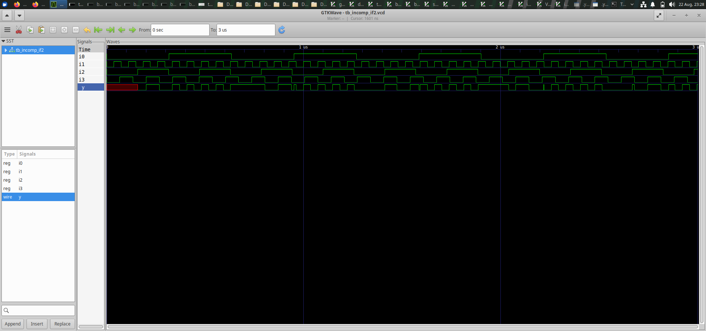
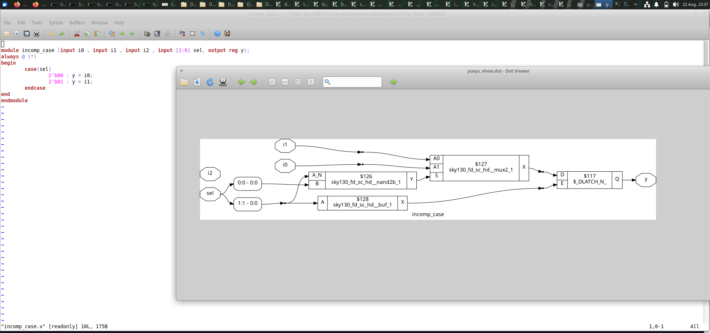
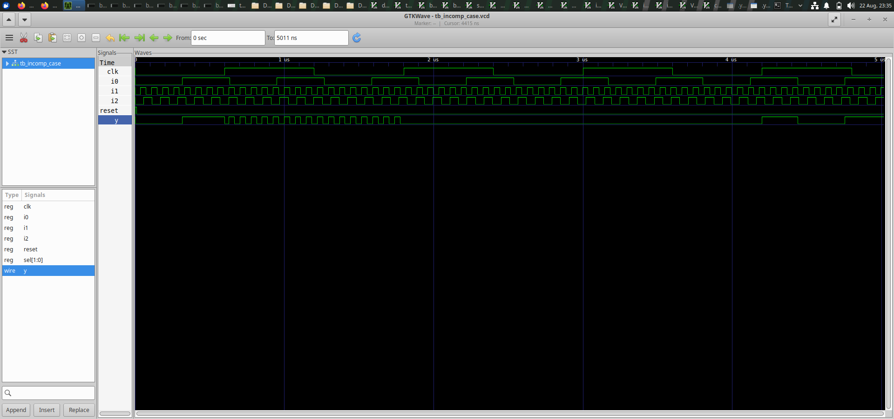
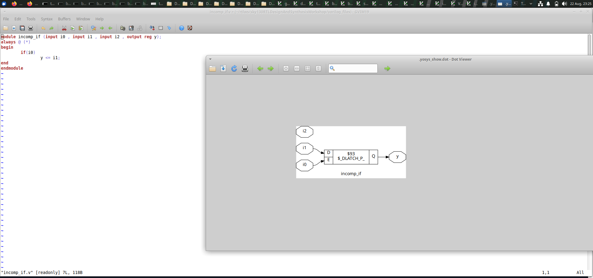
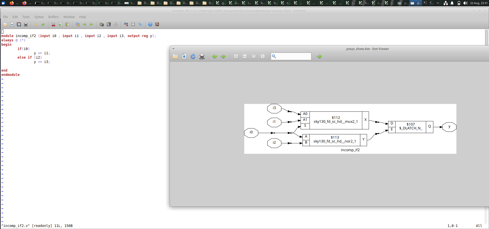

# Day 5 - IF-ELSE, CASE, and Looping Constructs

Day 5 focuses on understanding incomplete RTL descriptions and
how incomplete conditions can affect simulation and synthesis.

In this session, I worked with incomplete logic conditions and
case statements. The designs were simulated using GTKWave and
synthesized using Yosys to observe the difference between the
RTL description and the resulting hardware.

The experiments helped me understand how synthesis tools
interpret incomplete assignments and how the RTL coding style
can affect the synthesized circuit.

---

# Index

1. [Objective](#1-objective)
2. [Incomplete RTL Logic](#2-incomplete-rtl-logic)
3. [Incomplete RTL Simulation](#3-incomplete-rtl-simulation)
4. [Incomplete RTL Netlist](#4-incomplete-rtl-netlist)
5. [Incomplete Case Statement](#5-incomplete-case-statement)
6. [Incomplete Case Simulation](#6-incomplete-case-simulation)
7. [Incomplete Case Netlist](#7-incomplete-case-netlist)
8. [Second Incomplete Design](#8-second-incomplete-design)
9. [Overall Learning](#9-overall-learning)
10. [Conclusion](#10-conclusion)

---

# 1. Objective

The main objective of Day 5 was to understand the importance
of complete RTL descriptions and how incomplete conditions
are handled during simulation and synthesis.

The main concepts covered were:

- Incomplete RTL logic
- Conditional statements
- Case statements
- Complete and incomplete assignments
- RTL simulation
- GTKWave waveform analysis
- Yosys synthesis
- Netlist generation
- Difference between RTL and synthesized hardware
- Importance of proper RTL coding

---

# 2. Incomplete RTL Logic

## What I designed

In this experiment, I worked with an RTL design containing
incomplete logic conditions.

An incomplete RTL description occurs when an output is not
assigned for every possible input condition.

When this happens, the previous value of the output may need
to be retained. Depending on the type of logic, this can
result in storage behavior such as a latch during synthesis.

## Purpose

The purpose of this experiment was to understand how an
incomplete RTL description is interpreted by synthesis tools.

## Synthesis

The RTL was synthesized using Yosys and the resulting
hardware representation was observed.

## Result

This experiment showed that the way RTL is written can affect
the hardware inferred by the synthesis tool.

---

# 3. Incomplete RTL Simulation

## What I observed

The incomplete RTL design was simulated to check how the
output behaves when different input conditions are applied.

GTKWave was used to observe the input and output signals
over time.

The waveform helps identify situations where the output does
not receive a new assignment for every input condition.

## Waveform

## Result

The simulation helped me understand the behavior of an
incomplete RTL description and how the output responds to
different input combinations.

---

# 4. Incomplete RTL Netlist

## Synthesis

After simulation, the design was synthesized using Yosys.

The generated netlist was examined to understand what
hardware structure was inferred from the incomplete RTL.

## Result

The synthesized netlist demonstrates how Yosys converts the
RTL description into hardware and identifies the storage or
logic requirements created by the incomplete assignment.

---

# 5. Incomplete Case Statement

## What I designed

In this experiment, I worked with a case statement that does
not explicitly assign an output for every possible condition.

A case statement is commonly used to describe multiple
possible input conditions in RTL.

For combinational logic, it is important to ensure that the
output receives an appropriate assignment for all required
conditions.

## Purpose

The purpose of this experiment was to understand the effect
of an incomplete case statement during simulation and
synthesis.

## Synthesis Result

The RTL was synthesized using Yosys to observe the hardware
generated from the incomplete case description.

---

# 6. Incomplete Case Simulation

## Simulation

The incomplete case design was simulated and the waveform
was observed using GTKWave.

The waveform shows how the output behaves for the different
input and case conditions.

## Result

The simulation helped me understand that an incomplete case
statement can result in output behavior that depends on the
previous state when no new assignment is made.

This is an important consideration when writing combinational
RTL.

---

# 7. Incomplete Case Netlist

## Synthesis

The incomplete case design was synthesized using Yosys.

The generated netlist was inspected to understand the
hardware inferred from the RTL.

## Result

The synthesized netlist demonstrates how the synthesis tool
converts the incomplete case description into a hardware
implementation.

This experiment shows the importance of writing complete
conditions when describing combinational logic.

---

# 8. Second Incomplete Design

## What I designed

Another incomplete RTL example was used to further understand
the effect of missing assignments and conditions.

The design was simulated and synthesized so that the RTL
behavior could be compared with the resulting hardware.

## Synthesis

The second design was synthesized using Yosys and its
netlist was examined.

## Result

This experiment provided another example of how incomplete
RTL descriptions can influence the hardware inferred during
synthesis.

It reinforced the importance of assigning outputs properly
for the required input conditions.

---

# 9. Overall Learning

Through the experiments performed on Day 5, I understood the
following:

- What incomplete RTL means.
- How incomplete conditions affect RTL behavior.
- How case statements are used in RTL design.
- Importance of assigning outputs for required conditions.
- How incomplete combinational descriptions can infer
  storage behavior.
- How GTKWave can be used to analyze RTL waveforms.
- How Yosys synthesizes incomplete RTL descriptions.
- How to examine a synthesized netlist.
- Difference between RTL simulation and synthesized hardware.
- Importance of writing clear and complete RTL code.
- How coding style can influence the hardware generated by
  synthesis tools.

---

# 10. Conclusion

Day 5 helped me understand the importance of writing complete
and proper RTL descriptions.

I worked with incomplete logic and incomplete case statement
examples and observed their behavior through simulation and
synthesis.

By comparing the waveforms and synthesized netlists, I
understood how missing assignments or conditions can affect
the hardware inferred by synthesis tools.

This session improved my understanding of RTL coding practices
and showed why careful coding is important for generating the
intended digital hardware.
