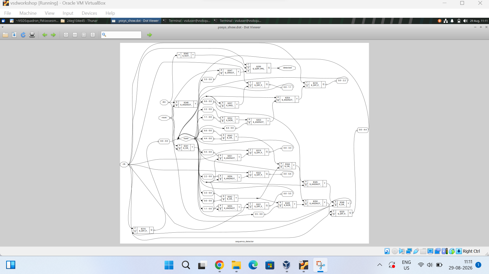

# RTL Design Workshop – Day 7

## Sequence Detector – RTL Simulation, Synthesis and GLS

---

## 📑 Index

1. [Objective](#objective)
2. [Sequence Detector Design](#sequence-detector-design)
3. [RTL Simulation](#rtl-simulation)
4. [Synthesis](#synthesis)
5. [Gate-Level Simulation](#gate-level-simulation)
6. [Results](#results)
7. [What I Learned](#what-i-learned)
8. [Conclusion](#conclusion)

---

## Objective

The objective of Day 7 is to design and verify a **7-bit sequence detector**
using Verilog and a Finite State Machine (FSM).

The target sequence is:

**0100000**

The design was simulated using Icarus Verilog and GTKWave, synthesized
using Yosys, and verified using Gate-Level Simulation (GLS).

---

## Sequence Detector Design

The sequence detector receives serial input through `din` and checks
the incoming bits using an FSM.

### Inputs

- `clk` – Clock signal
- `reset` – Reset signal
- `din` – Serial input

### Output

- `detected` – Indicates successful detection of the sequence

The FSM consists of **7 states** and uses **3 state bits**.

The sequence being detected is:

**0100000**

When the complete sequence is received, the `detected` signal becomes
high.

---

## RTL Simulation

The Verilog RTL was simulated using **Icarus Verilog**.

The clock was generated using a 10 ns period:

- Half period = 5 ns
- Clock period = 10 ns
- Frequency = 100 MHz

The generated VCD file was opened in **GTKWave** to observe:

- `clk`
- `reset`
- `din`
- `detected`
- `detection_count`

The RTL simulation successfully detected the target sequence **4 times**.

### RTL Waveform

---

## Synthesis

The RTL design was synthesized using **Yosys**.

The synthesis converts the Verilog RTL into a gate-level netlist.

### Synthesis Statistics

- Total cells = **27**
- Sequential cells = **8**
- Combinational cells = **19**
- State width = **3 bits**
- FSM states = **7**

### Synthesis Statistics Result

### Synthesized Netlist

The synthesized netlist contains flip-flops and combinational logic
used to implement the FSM and sequence detection logic.

---

## Gate-Level Simulation

After synthesis, the generated gate-level netlist was simulated again.

The GLS waveform was observed using GTKWave.

The gate-level simulation also detected the target sequence **4 times**.

### GLS Waveform

---

## Results

| Parameter | Result |
|---|---|
| Target Sequence | `0100000` |
| FSM States | 7 |
| State Width | 3 bits |
| Clock Period | 10 ns |
| Clock Frequency | 100 MHz |
| RTL Detection Count | 4 |
| GLS Detection Count | 4 |
| Total Synthesized Cells | 27 |
| Sequential Cells | 8 |
| Combinational Cells | 19 |

The RTL and GLS simulations show the same logical detection behavior.
Small timing differences may occur because GLS represents the
synthesized gate-level circuit and its propagation delays.

---

## What I Learned

From this experiment, I learned:

- How to design a sequence detector using an FSM.
- How to write sequential and combinational RTL.
- How to simulate Verilog using Icarus Verilog.
- How to analyze waveforms using GTKWave.
- How to synthesize RTL using Yosys.
- How to read synthesis statistics.
- How to analyze a synthesized netlist.
- How to perform Gate-Level Simulation.
- How to compare RTL and GLS results.

---

## Conclusion

The 7-bit sequence detector was successfully designed, simulated,
synthesized and verified.

The target sequence **0100000** was detected **4 times** in both RTL
and Gate-Level Simulation.

The synthesized implementation preserves the functional behavior of
the original RTL design.

---

### 🔝 Back to Index

[Back to Index](#index)
