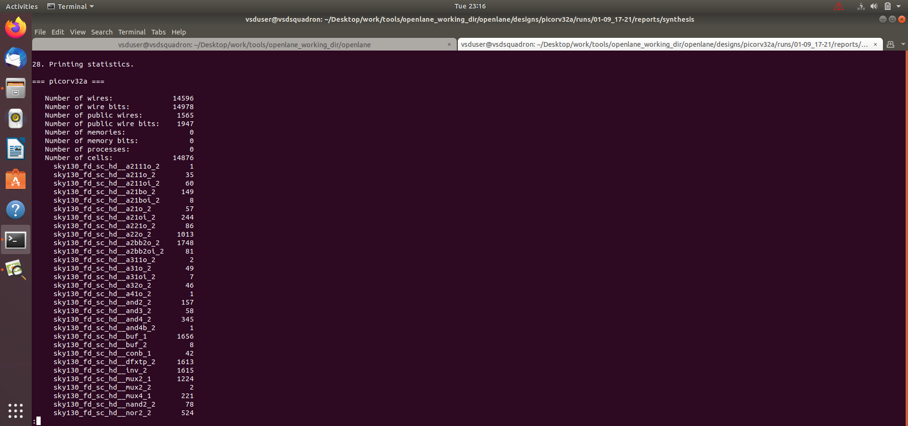
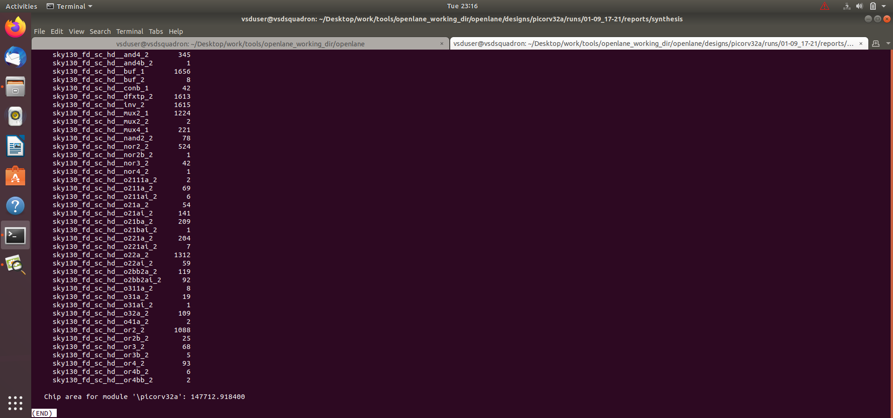
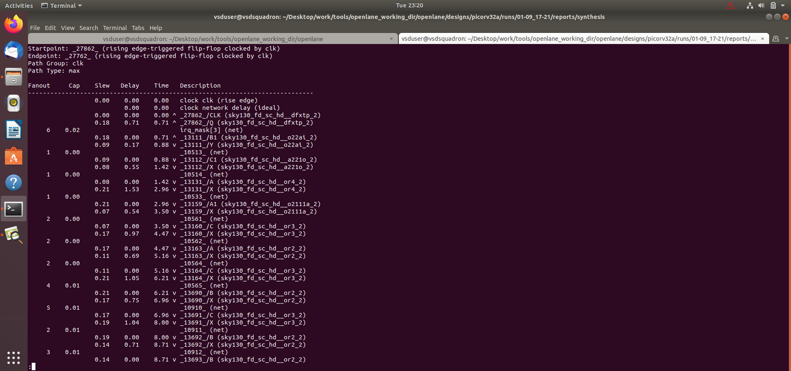

# ASIC Design and SoC Chip – Module 1

## PicoRV32A ASIC Design Flow using OpenLane

---

## Index

1. Introduction
2. Objective
3. Design Used
4. ASIC Design Flow
5. Configuration and Flow Files
6. Synthesis and Statistics
7. Floorplanning and Physical Design
8. LEF Merging
9. Timing Analysis
10. Results and Conclusion

---

## 1. Introduction

This module focuses on the basic ASIC design flow of the **PicoRV32A RISC-V processor** using the **Sky130 PDK** and OpenLane-based tools.

The design is taken through important stages such as configuration, synthesis, floorplanning, placement, routing, LEF merging and timing analysis.

---

## 2. Objective

- Understand the ASIC design flow.
- Configure the PicoRV32A design.
- Perform RTL synthesis.
- Analyze synthesis statistics.
- Generate and inspect the physical design.
- Understand LEF merging.
- Perform timing analysis using OpenSTA.
- Study the generated reports and netlists.

---

## 3. Design Used

### PicoRV32A

PicoRV32A is a compact **32-bit RISC-V processor core**.

The design is implemented using RTL and processed through the ASIC implementation flow targeting the **Sky130** technology.

---

## 4. ASIC Design Flow

The major steps followed in this module are:

**RTL Design → Configuration → Synthesis → Floorplanning → Placement → CTS → Routing → LEF Merging → Timing Analysis → Reports**

The flow converts the RTL description into a physical ASIC implementation.

---

## 5. Configuration and Flow Files

The following files/images document the configuration and OpenLane flow:

- `config_tcl.png`
- `flow.tcl_innteracrives.png`
- `less cmnd-tcl.png`
- `less config_tcl.png`
- `sky130.tcl.png`
- `design_picorva dates.png`

These files show the configuration, commands and flow settings used during the ASIC implementation.

---

## 6. Synthesis and Statistics

The PicoRV32A design was synthesized and the generated statistics were analyzed.

### Synthesis Statistics

The statistics provide information about the synthesized design, including the number of cells, wires and other implementation details.

---

## 7. Floorplanning and Physical Design

After synthesis, the design proceeds through the physical implementation stages.

These stages include:

- Floorplanning
- Power planning
- Placement
- Clock Tree Synthesis
- Routing

The generated physical design is inspected to understand how the synthesized logic is arranged on the chip.

### Physical Design

---

## 8. LEF Merging

LEF files contain physical information about standard cells and macros.

The LEF files are merged so that the physical implementation tools can use the required technology and cell information.

### LEF Merging

---

## 9. Timing Analysis

Timing analysis is performed to check whether the implemented design satisfies the required timing constraints.

**OpenSTA** is used for static timing analysis.

### OpenSTA Report

The timing report helps identify timing paths, delays and possible setup or hold violations.

---

## 10. Results and Conclusion

The PicoRV32A design was successfully taken through the basic ASIC implementation flow using the Sky130 technology.

The synthesis statistics, physical design, LEF merging and OpenSTA timing reports were analyzed. This module provides practical understanding of converting a RISC-V RTL design into an ASIC-ready physical implementation.

---

## Files

- `README.md`
- `config_tcl.png`
- `design_picorva_dates.png`
- `designs_picorv32a_merging_lefs.png`
- `flow.tcl_innteracrives.png`
- `less cmnd-tcl.png`
- `less config_tcl.png`
- `less merged.png`
- `less merged2.png`
- `less merged 3.png`
- `opensta_report.png`
- `picorv32_stats1.png`
- `picorv32a_stats.png`
- `picorv32a_stats2.png`
- `picorv32a_synthesis_netlist.png`
- `sky130.tcl.png`
- `synthesis_report.png`

---

## Tools and Technologies

- Verilog / RTL
- PicoRV32A
- OpenLane
- Yosys
- OpenSTA
- Sky130 PDK
- ASIC Physical Design Tools
- Linux / Ubuntu
