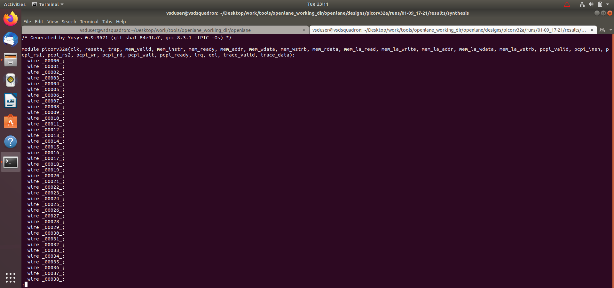

# ASIC Design and SoC Chip 

## PicoRV32A ASIC Design Flow using OpenLane

---

## Index

1. [Introduction](#1-introduction)
2. [Objective](#2-objective)
3. [Design Used](#3-design-used)
4. [ASIC Design Flow](#4-asic-design-flow)
5. [Configuration and Flow Files](#5-configuration-and-flow-files)
6. [Synthesis and Statistics](#6-synthesis-and-statistics)
7. [Floorplanning and Physical Design](#7-floorplanning-and-physical-design)
8. [LEF Merging](#8-lef-merging)
9. [Timing Analysis](#9-timing-analysis)
10. [Results and Conclusion](#10-results-and-conclusion)

---

## 1. Introduction

This module focuses on the basic ASIC design flow of the **PicoRV32A RISC-V processor** using the **Sky130 PDK** and OpenLane-based tools.

The design is taken through important stages such as configuration, synthesis, floorplanning, placement, routing, LEF merging and timing analysis.

This module provides practical understanding of converting an RTL design into a physical ASIC implementation.

---

## 2. Objective

- Understand the basic ASIC design flow.
- Configure the PicoRV32A design.
- Perform RTL synthesis.
- Analyze synthesis statistics.
- Generate and inspect the physical design.
- Understand floorplanning and placement.
- Understand LEF merging.
- Perform timing analysis using OpenSTA.
- Study the generated reports and netlists.
- Understand the RTL-to-GDS physical design flow.

---

## 3. Design Used

### PicoRV32A

PicoRV32A is a compact **32-bit RISC-V processor core**.

The design is implemented using RTL and processed through the ASIC implementation flow targeting the **Sky130** technology.

The PicoRV32A design is used as the main example for understanding synthesis and physical implementation in this module.

---

## 4. ASIC Design Flow

The major steps followed in this module are:

**RTL Design → Configuration → Synthesis → Floorplanning → Placement → CTS → Routing → LEF Merging → Timing Analysis → Reports**

The flow converts the RTL description into a physical ASIC implementation.

The general ASIC design flow can be represented as:

RTL Design
     |
     v
Configuration
     |
     v
Synthesis
     |
     v
Floorplanning
     |
     v
Placement
     |
     v
Clock Tree Synthesis
     |
     v
Routing
     |
     v
LEF Merging
     |
     v
Timing Analysis
     |
     v
Reports and Results

---

## 5. Configuration and Flow Files

The following files document the configuration and OpenLane flow used in this module:

- `config_tcl.png`
- `flow.tcl _innteracrives.png`
- `less cmnd-tcl.png`
- `less config_tcl.png`
- `sky130.tcl.png`
- `design_picorva dates.png`

These files contain screenshots and references related to the configuration, commands and physical design flow.

The Tcl configuration files are used to define important design and technology parameters required by the ASIC implementation tools.

---

## 6. Synthesis and Statistics

The PicoRV32A design is synthesized using the ASIC synthesis flow.

Synthesis converts the RTL description into a gate-level netlist using standard cells from the target technology library.

### Synthesis Report

The synthesis report provides information about the generated design and helps in analyzing the synthesized circuit.

### PicoRV32A Statistics

The statistics provide information about the synthesized design, including:

- Number of cells
- Number of instances
- Number of wires
- Number of nets
- Logic utilization
- Design area
- Synthesis information

These statistics are useful for understanding the complexity and size of the synthesized PicoRV32A design.

### Synthesis Netlist

The synthesis netlist represents the RTL design after conversion into a gate-level representation.

---

## 7. Floorplanning and Physical Design

After synthesis, the design proceeds to the physical implementation stages.

Floorplanning determines the physical organization of the design on the chip.

Important physical design stages include:

- Floorplanning
- Power planning
- Placement
- Clock Tree Synthesis
- Routing

### Physical Design

The generated physical design is inspected to understand how the synthesized logic is physically arranged inside the chip.

Floorplanning also determines important parameters such as:

- Die area
- Core area
- Aspect ratio
- Utilization
- I/O locations

A suitable floorplan is important for achieving good timing, routing and area characteristics.

---

## 8. LEF Merging

LEF stands for **Library Exchange Format**.

LEF files contain physical information about standard cells, macros and technology layers.

LEF merging combines the required physical information so that the physical design tools can correctly understand the technology and standard-cell libraries.

### LEF Merging

### Merged Design

The merged LEF information is used during the physical implementation stages.

LEF data is important because it provides physical information such as:

- Cell dimensions
- Pin locations
- Metal layers
- Routing information
- Obstruction information
- Physical cell characteristics

---

## 9. Timing Analysis

Timing analysis is performed to verify whether the implemented design satisfies the required timing constraints.

**OpenSTA** is used for Static Timing Analysis (STA).

### OpenSTA Report

The timing report provides information about:

- Timing paths
- Cell delays
- Net delays
- Arrival time
- Required time
- Slack
- Setup analysis
- Hold analysis

Static timing analysis is important for identifying timing violations and ensuring that the design operates correctly at the required clock frequency.

---

## 10. Results and Conclusion

The PicoRV32A design was successfully taken through the basic ASIC implementation flow using the **Sky130 technology** and OpenLane-based tools.

The module covered the major stages of the ASIC design process, starting from RTL configuration and synthesis and continuing through physical design, LEF merging and timing analysis.

The synthesis reports and design statistics were analyzed to understand the characteristics of the generated gate-level design.

The physical design results were inspected to understand floorplanning and layout implementation.

LEF merging was studied to understand how physical library information is prepared for the implementation tools.

OpenSTA was used for timing analysis to examine timing paths and slack values.

Overall, this module provides practical understanding of the **RTL-to-physical ASIC design flow** using an open-source RISC-V processor and the Sky130 technology.

---

## Files

- `README.md`
- `config_tcl.png`
- `design_picorva dates.png`
- `designs_picorv32a merging lefs.png`
- `flow.tcl _innteracrives.png`
- `less cmnd-tcl.png`
- `less config_tcl.png`
- `less merged.png`
- `less merged2.png`
- `less merged 3.png`
- `opensta_report.png`
- `picorv32_stats1.png`
- `picorv32a stats .png`
- `picorv32a_stats2.png`
- `picorv32a_synthesis_netlist.png`
- `sky130.tcl.png`
- `synthesis_report.png`

---

## Tools and Technologies

- Verilog / RTL
- PicoRV32A
- OpenLane
- Yosys
- OpenROAD
- OpenSTA
- Magic
- Sky130 PDK
- Tcl
- ASIC Physical Design Tools
- Linux / Ubuntu

---

## Key Learnings

Through this module, the following concepts were studied:

- RTL-to-GDS ASIC design flow
- RISC-V processor implementation
- RTL synthesis
- Gate-level netlist generation
- Synthesis statistics
- Floorplanning
- Physical design
- LEF and physical libraries
- Placement
- Clock Tree Synthesis
- Routing
- Static Timing Analysis
- OpenSTA timing reports
- Sky130 technology
- OpenLane-based ASIC implementation
