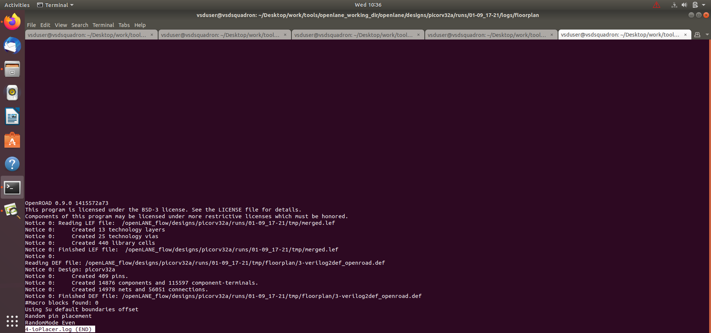
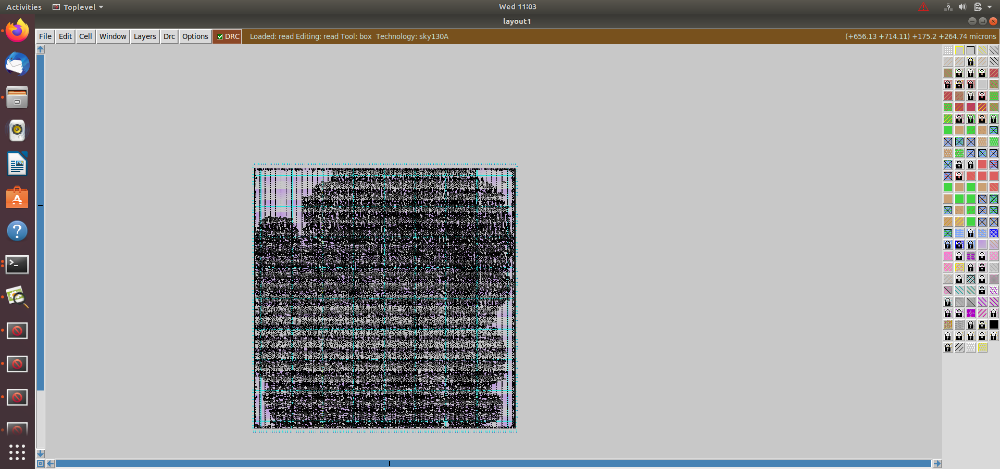
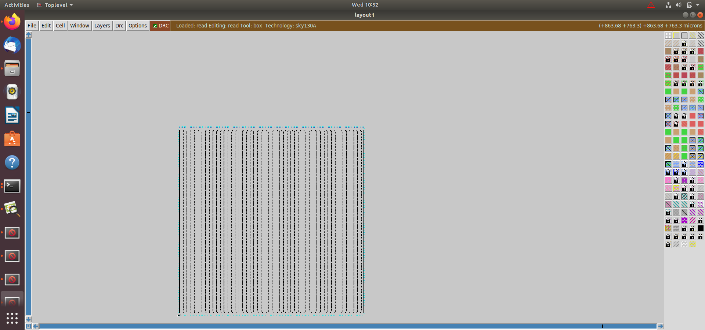

# ASIC Design and SoC Chip 

## Floorplanning and Physical Design using OpenLane

---

## Index

1. [Introduction](#1-introduction)
2. [Objective](#2-objective)
3. [ASIC Design Flow](#3-asic-design-flow)
4. [Configuration and Flow Files](#4-configuration-and-flow-files)
5. [Design Statistics](#5-design-statistics)
6. [Floorplanning](#6-floorplanning)
7. [I/O Placement](#7-io-placement)
8. [Placement and Layout](#8-placement-and-layout)
9. [Floorplan Review and Analysis](#9-floorplan-review-and-analysis)
10. [Results and Conclusion](#10-results-and-conclusion)

---

## 1. Introduction

This module focuses on the floorplanning and early physical design stages of the ASIC design flow using the Sky130 PDK and OpenLane-based tools.

The design is taken through configuration, floorplanning, I/O placement and standard-cell placement. The generated floorplans and layouts are then inspected using physical design and layout visualization tools.

This module provides practical understanding of how the synthesized design is physically organized inside the chip.

---

## 2. Objective

- Understand the basics of ASIC physical design.
- Understand the concept of floorplanning.
- Configure the physical design flow using Tcl.
- Generate and analyze different floorplans.
- Understand core area and die area.
- Study utilization and aspect ratio.
- Perform I/O placement.
- Analyze standard-cell placement.
- Inspect the generated layout using Magic.
- Compare different floorplanning results.
- Understand the effect of floorplanning on the physical implementation.

---

## 3. ASIC Design Flow

The major steps followed in this module are:

RTL Design → Configuration → Synthesis → Floorplanning → I/O Placement → Placement → Layout Visualization → Analysis

The main focus of this module is on the floorplanning, I/O placement and placement stages of the ASIC physical design flow.

The general physical design flow can be represented as:

RTL Design
     |
     v
Configuration
     |
     v
Synthesis
     |
     v
Floorplanning
     |
     v
I/O Placement
     |
     v
Standard Cell Placement
     |
     v
Layout Generation
     |
     v
Physical Design Analysis

---

## 4. Configuration and Flow Files

The following files document the configuration and floorplanning flow:

- config.tcl review floorplans.png
- config.tcls.png
- sky130_config.tcl review floorplann.png
- run floor_plan.png

These files show the configuration and commands used to run the floorplanning flow.

The Tcl configuration files contain important physical design parameters used by the implementation tools.

---

## 5. Design Statistics

The design statistics generated during the implementation flow are analyzed to understand the characteristics of the design.

### Design Statistics

The statistics provide information about the implemented design, including details related to:

- Standard cells
- Nets
- Instances
- Area
- Utilization
- Design size
- Physical implementation data

These values are useful for evaluating the quality of the generated physical design.

---

## 6. Floorplanning

Floorplanning is one of the most important stages of the ASIC physical design flow.

During floorplanning, the physical dimensions and organization of the chip are determined.

Important floorplanning parameters include:

- Die area
- Core area
- Core utilization
- Aspect ratio
- Placement area
- I/O pin locations

### Floorplan 1

### Floorplan 2

Different floorplans are generated and analyzed to understand how changes in physical parameters affect the design.

A good floorplan should provide sufficient space for cell placement and routing while maintaining reasonable area and utilization.

---

## 7. I/O Placement

I/O placement determines the physical locations of the input and output pins around the core area.

The placement of I/O pins has an important effect on:

- Routing length
- Routing congestion
- Timing
- Physical connectivity
- Overall design quality

### I/O Placement

The I/O placement results are inspected to verify that the pins are properly distributed around the design.

---

## 8. Placement and Layout

After floorplanning and I/O placement, standard cells are placed inside the core area.

The placement stage determines the physical locations of the standard cells while attempting to optimize:

- Wirelength
- Timing
- Area
- Congestion
- Routability

### Placement Layout

The generated placement provides a physical representation of the synthesized logic.

---

## 9. Floorplan Review and Analysis

The generated floorplans are reviewed to compare different physical implementations.

### Floorplan Layout using Magic

Magic is used to visualize and inspect the generated physical layout.

### Results Floorplan

The floorplan results are analyzed based on:

- Core utilization
- Die and core dimensions
- Aspect ratio
- Cell distribution
- I/O placement
- Available routing resources
- Possible congestion

Comparing multiple floorplans helps in understanding the relationship between physical constraints and the quality of the final layout.

---

## 10. Results and Conclusion

The design was successfully taken through the floorplanning and early physical design stages using the Sky130 technology.

Different floorplans were generated and analyzed along with I/O placement and standard-cell placement results.

The generated layout was also inspected using Magic to understand the physical organization of the design.

This module provides practical understanding of:

- ASIC floorplanning
- Core and die dimensions
- Utilization
- Aspect ratio
- I/O placement
- Standard-cell placement
- Physical layout visualization
- Floorplan comparison
- SKY130 physical design configuration

The results demonstrate how decisions made during floorplanning and placement affect the overall physical implementation of an ASIC.

---

## Files

- README.md
- config.tcl review floorplans.png
- config.tcls.png
- design stats.png
- floorplan 1.png
- floorplan 2.png
- floorplan_layout1_magic.png
- ioplacer.log.png
- placement_layout1.png
- readme.ma.png
- results_floorplan.png
- run floor_plan.png
- sky130_config.tcl review floorplann.png

---

## Tools and Technologies

- Verilog / RTL
- OpenLane
- Yosys
- OpenROAD
- Magic
- Sky130 PDK
- Tcl
- ASIC Physical Design Tools
- Linux / Ubuntu
